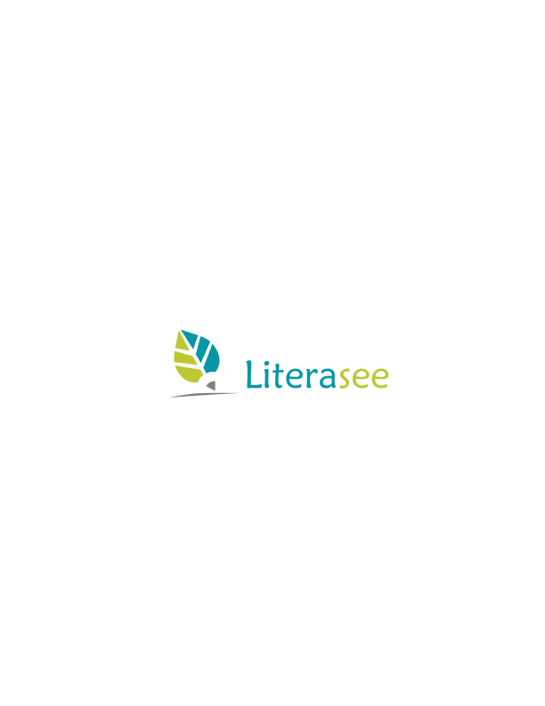

 

Literasee supports mathematics typesetting via [MathJax](https://www.mathjax.org/) :smile:

Give it a try using the manual and associated presentation: 

* [Report](http://view.literasee.io/literasee/basic_mathematics/)
* [Presentation](http://view.literasee.io/literasee/basic_mathematics/presentation/#/)
